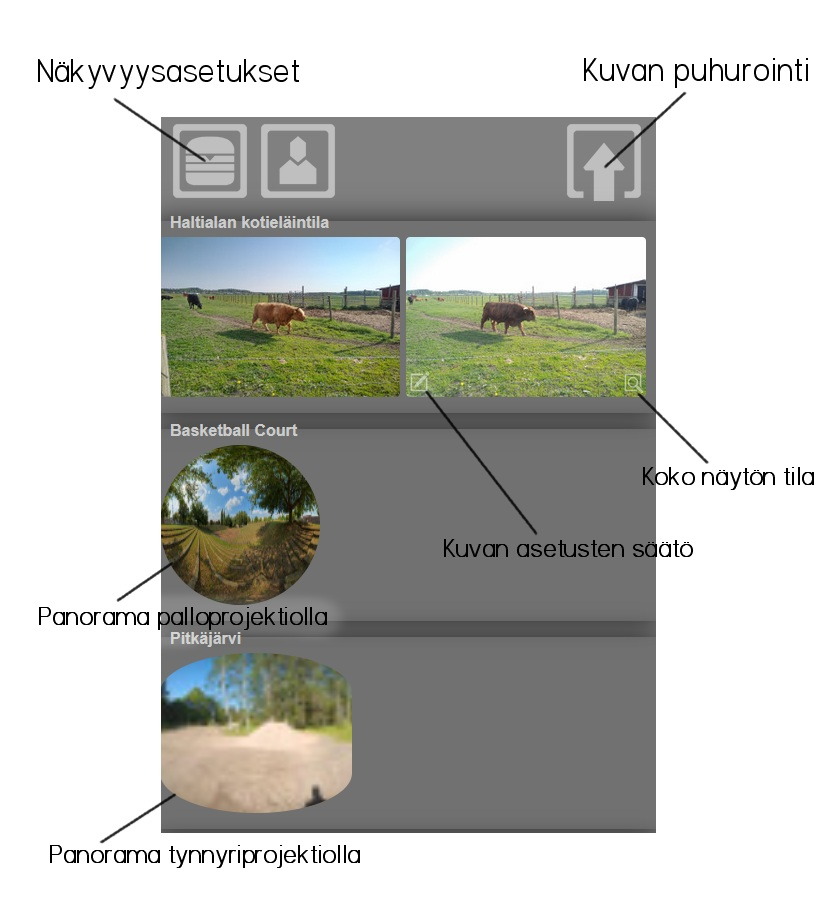
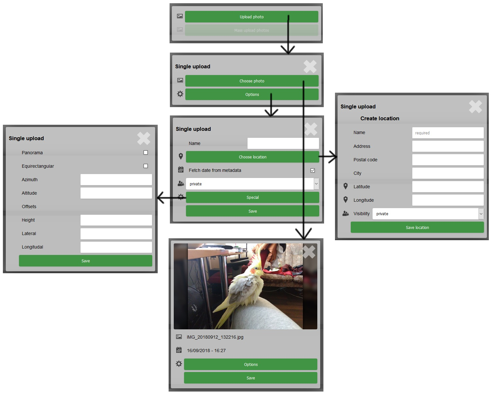
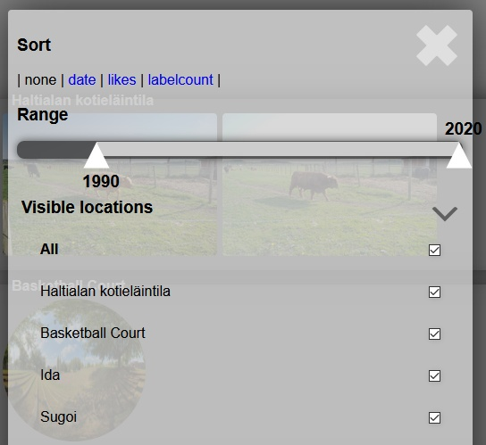
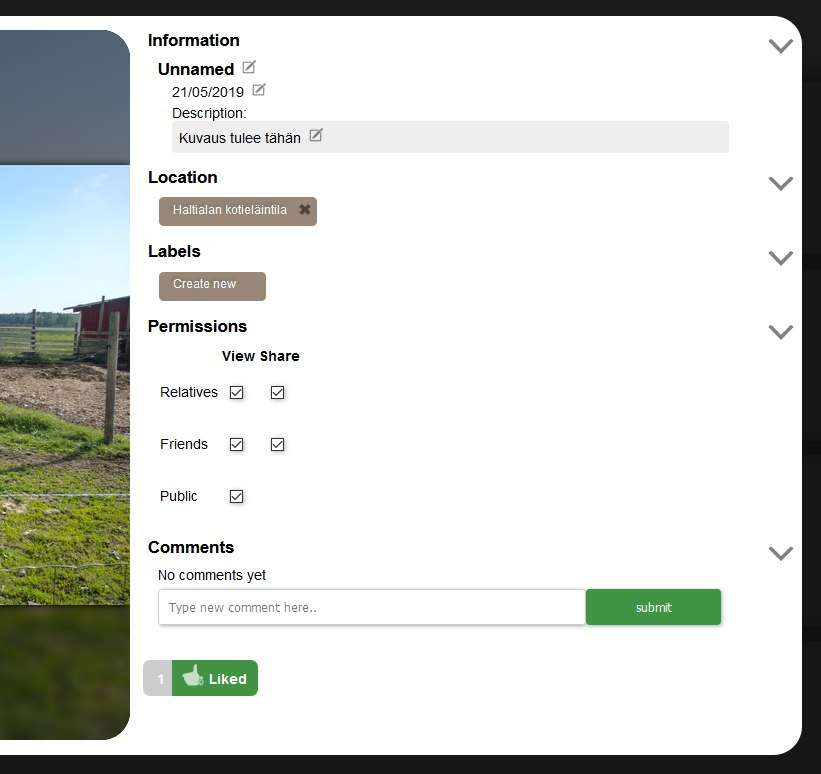

# Käyttöohje

Uusien käyttäjien todentaminen toimii toistaiseksi manuaalisesti

## Toiminta

Kirjautumaton käyttäjä pystyy vain tarkastelemaan julkisia kuvia, muihin ominaisuuksiin pääsee käsiksi vasta kirjautumisen jälkeen:

### Perusnäkymä

Kirjautuneelle käyttäjälle näkyvä näkymä. Kuvat sortataan sijainnin perusteella omiin strippeihin. Jos kuvaan on omistajuus, sen sijainnin pystyy määrittelemään tässä näkymässä vetämällä sen toiseen sijaintiin.

Yksittäisten kuvien lisätietoihin pääsee asetustensäätö -napista.

### Puhurointi

Yksinkertaisimmillaan kuvan voi vain valita ja lähettää. Halutessaan käyttäjä voi kuitenkin lähettää kuvan mukana melko paljon tietoa:
 Sijainnin voi tallentaa tietokantaan tarkasti, kuvan aikaleiman pystyy joko lukemaan tiedostosta tai määrittämään manuaalisesti, kuvan näkyvyysasetukset pystyy karkeasti määrittämään (tarkempi määritys seuraavassa osiossa) sekä kuvalle voi määrittää 3d-asemoinnin erikoisasetuksia.

### Näkyvyysasetukset

Täällä voi säätää kuvastrippien näkyvyysasetuksia. Kuvia voi järjestellä sekä piilottaa niiden aikaleimasta ja sijainnista riippuen.

### Kuvan asetusten säätö

Tästä näkymästä yksittäisen kuvan perustietoja ja asetuksia voi muuttaa. Location -moduuli on sama kuin puhurointimoduulissa, eli siinä toiminnallisuus sama. Labeleita klikkaamalla näkee kaikki muut samantunnisteiset kuvat joihin on katseluoikeus. Jos tästä näkymästä siirtyy toisen kuvan editoriin ja klikkaa labelia, labelit yhdistyy AND -hauksi.

Oikeuksilla voi rajat kuvan näkyvyyttä, esim jakaa kuvat lähimmille/kaikille sukulaisille, ystäville tai koko maailmalle. Oikeudet tallennetaan backendiin, mutta toistaiseksi vain julkinen jako on implementoituna kuvien haussa.

Kuvaneditointinäkymä näkyy myös kuvan omistamattomalle käyttäjälle, sillä rajoituksella että kuvaa voi vain tykätä tai kommentoida. Tunnisteet kuitenkin toimii kuten omistajallakin.

## Muuta

### Todo

- Käyttäjärelaatiot ja -asetukset. Tällä hetkellä serveri näyttää vain ne kuvat jotka käyttäjä on puhuroinut tai muut käyttäjät ovat merkinneet julkisiksi
- Sijainneissa vielä vajaa toteutus, olemassaolevia ei voi editoida ja oikeudet erottelee vain kirjautuneen/kirjautumattoman välillä.
- Panoramoihin hiirikontrolli
- Panoramoihin mukaan asemoituna kaikki sijainnin kuvat joihin on tallennettu asemoinnin erikoisasetuksia
- Mailiserveri uusien käyttäjien todentamiseen
- Kuvien poisto
- Dynaamisia hakuja, esim sijainnin parametrien perusteella

### Löydetyt bugit

- Jos puhuroitavan kuvan sijaintia ei ole olemassa, sijainti ja kuva tulee näkyviin vasta refreshillä
- Näkyvyysasetukset ei toimi kuvan puhuroimiskäyttöliittymässä. Toimii kuitenkin oikein varsinaisessa kuvanäkymässä.
